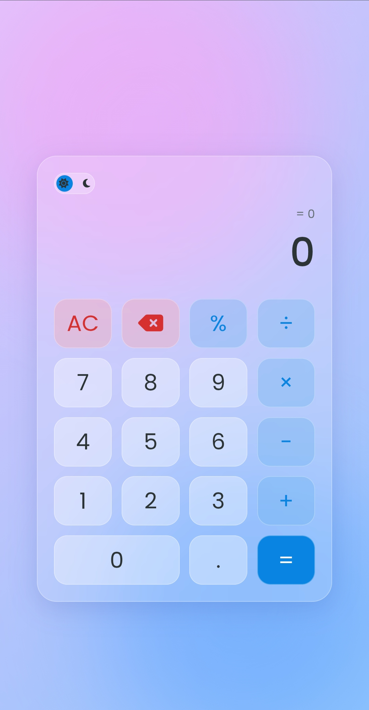
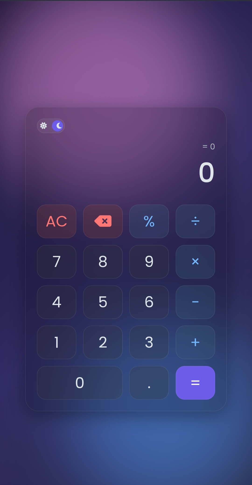
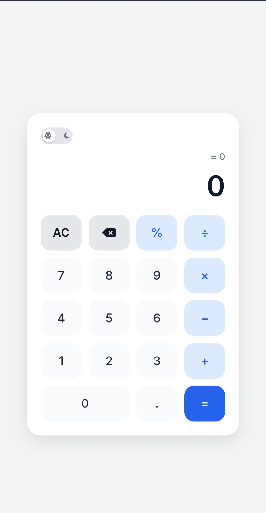
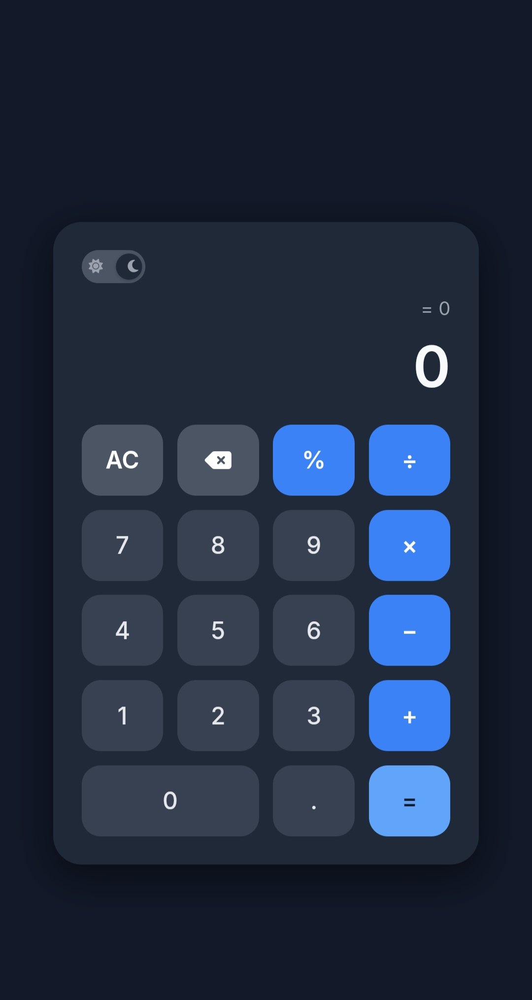

<h1 align="center">📱 Scientific Dual-Theme Calculator</h1>

<p align="center">
  
  
  
  
</p>

<p align="center">  
A sleek, high-performance calculator with **Day/Night Mode**, **Automatic Theme Detection**, and **two premium UI styles** — <br>  
<b>Glassy Mode</b> for futuristic vibes and <b>Simple Mode</b> for classic elegance.
</p>

---

## 🌟 Features

### 🎭 **Dual Theme Experience**
- 🌞 **Day Mode** for bright environments  
- 🌙 **Night Mode** for low-light comfort  
- 🖥️ **Auto Theme Detection** — adapts instantly to your system settings

### 🧊 **Two UI Styles**
- **Glassy Mode:** Modern frosted-glass design  
- **Simple Mode:** Clean, traditional layout

### ⚡ Core Highlights
- 🔢 Standard calculator functionality  
- 📱 Fully responsive design for mobile & desktop  
- 🚀 Smooth animations  
- 🎯 Intuitive button layout  
- 🧩 Lightweight & fast — no frameworks needed  

---

## 🖼️ Screenshots  
<p align="center">
  
  <br><br>
  
  
</p>

---

## 🚀 Live Demo  

http://Sayan124.github.io/Calculator

---

## 🛠️ Tech Stack  
<p align="center">
  
</p>

- **HTML5**  
- **CSS3** (Glassy Design, Custom Themes)  
- **JavaScript**  
- Git & GitHub  

---

## 📦 Installation

```bash
git clone https://github.com/Sayan124/Calculator.git
cd Calculator

```
Open index.html in your browser.


---

🧠 Design Philosophy

A blend of modern UI innovation and nostalgic simplicity.
This calculator is crafted to:

Respect traditional design language

Embrace futuristic glass aesthetics

Deliver a frictionless user journey

Adjust to your environment dynamically


A nod to the past, a step into tomorrow. ✨


---

🤝 Contributing

PRs are welcome.
For major features, open an issue first to discuss ideas.


---

📜 License

MIT License © 2025


---

⭐ Support

If you like this project, don’t forget to star the repository — your support fuels future upgrades!

<p align="center">
  
</p>